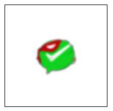

English | [简体中文](./README.CN.md) 

# Cax [](https://www.npmjs.com/package/cax) 

> HTML5 Canvas 2D Rendering Engine
  
## Features

* Simple API, Lightweight and High performance
* Support PC and Mobile Canvas 2D Rendering and Mouse and Touch Event
* Support event of element and element management like DOM
* Turing complete group nesting system
* Support clip and clip transformation
* Built-in Text, Bitmap, Sprite, Graphics and Shape
* Support [SVG Path](https://github.com/dntzhang/cax/blob/master/packages/cax/src/render/display/shape/path.js) rendering
* Support [CSS filter](https://github.com/dntzhang/cax/tree/master/packages/cax/src/render/filter)
* Built-in images loader
* Built-in cross platform motion library [→ to2to](https://github.com/dntzhang/cax/tree/master/packages/to)


## Demo
  * [Wechart by Cax](https://github.com/dntzhang/wechart)
  * [Simple](https://dntzhang.github.io/cax) 
  * [Animation](https://dntzhang.github.io/cax/packages/cax/examples/to/) 
  * [Clip](https://dntzhang.github.io/cax/packages/cax/examples/clip/) 
  * [Clip Transform](https://dntzhang.github.io/cax/packages/cax/examples/clip-transform/) 
  * [Clip Transition](https://dntzhang.github.io/cax/packages/cax/examples/clip-transition/) 
  * [To2To Animate](https://dntzhang.github.io/cax/packages/cax/examples/to-animate/) 
  * [Swing](https://dntzhang.github.io/cax/packages/to/examples/swing/) 
  * [Cax + Matter](https://dntzhang.github.io/cax/packages/cax/examples/matter/) 
  * [Pie Chart](https://dntzhang.github.io/wechart/packages/pie/examples/simple/)
  * [To + Shape](https://dntzhang.github.io/cax/packages/cax/examples/to-shape/)
  * [Vision](https://dntzhang.github.io/cax/packages/cax/examples/vision/)
  * [Cache](https://dntzhang.github.io/cax/packages/cax/examples/cache/)
  * [Filter](https://dntzhang.github.io/cax/packages/cax/examples/filter/)
  * [SVG](https://dntzhang.github.io/wechart/packages/path/examples/man/)
  * [Graphics](https://dntzhang.github.io/cax/packages/cax/examples/graphics/)
  * [Composite Operation](http://dntzhang.github.io/cax/packages/cax/examples/composite-operation/)

[→ Demo Source Code](https://github.com/dntzhang/cax/tree/master/packages/cax/examples)  

## Weapp Demo


## Docs

- [Getting Started](#getting-started)
- [Built-in Object](#built-in-object)
  - [Group](#group)
    - [Method](#group-method)
      - [add](#add)
      - [remove](#remove)
      - [empty](#empty)
      - [replace](#replace)
  - [Stage](#stage)
    - [Method](#stage-method)
      - [update](#update)
      - [scaleEventPoint](#scaleeventpoint)
    - [Prop](#stage-prop)  
      - [disableMoveDetection](#disablemovedetection)      
  - [Bitmap](#bitmap)
    - [Prop](#bitmap-prop)  
      - [rect](#rect)       
  - [Sprite](#sprite)
    - [Method](#sprite-method)
      - [gotoAndPlay](#gotoandplay)
      - [gotoAndStop](#gotoandstop)
      - [gotoAndPlayOnce](#gotoandplayonce)
  - [Text](#text)
    - [Method](#text-method)
      - [getWidth](#getwidth)  
  - [Graphics](#graphics)
  - [Shape](#shape)
    - [Rect](#rect-1)
    - [Circle](#circle)
    - [Ellipse](#ellipse)
  - [Element](#element)
	- [Button](#button)
- [Property](#property)
  - [Transform](#transform)
  - [Alpha](#alpha)
  - [CompositeOperation](#compositeoperation)
  - [Cursor](#cursor)
  - [Fixed](#fixed)
  - [Shadow](#shadow)
- [Method](#method)  
  - [destroy](#destroy)
- [Event](#event)
- [Motion](#motion)
- [Clip](#clip)
- [Custom Object](#custom-object)
	- [Custom Shape](#custom-shape) 
  - [Custom Element](#custom-element) 
- [Who is using cax?](#who-is-using-cax)
- [License](#license)

## Getting Started

Get cax through npm or cdn:

``` bash
npm i cax
```

* [https://unpkg.com/cax@latest/dist/cax.min.js](https://unpkg.com/cax@latest/dist/cax.min.js)
* [https://unpkg.com/cax@latest/dist/cax.js](https://unpkg.com/cax@latest/dist/cax.js)

Usage:

``` js
import cax from 'cax'

const stage = new cax.Stage(200, 200, 'body')

cax.loadImgs({
  imgs: ['./wepay-diy.jpg'],
  complete: (imgs) => {
    const img = imgs[0]
    const bitmap = new cax.Bitmap(img)

    bitmap.x = stage.width / 2
    bitmap.y = stage.height / 2
    bitmap.rotation = -10
    bitmap.originX = img.width / 2
    bitmap.originY = img.height / 2
    bitmap.filter('blur(10px)')

    stage.add(bitmap)
    stage.update()
  }
})
```

You will see the following effect:



## Built-in Object

### Group

For grouping, group can also nested group, and the parent container's properties will be superimposed on child properties, such as:

* the x of group is 100, the x of bitmap in group is 200, and the x of the bitmap rendered to stage is 300.
* the alpha of group is 0.7, the alpha of bitmap in group is 0.6, and the alpha of the bitmap rendered to stage is 0.42.

```js
const group = new cax.Group()
const rect = new cax.Rect(100, 100 {
  fillStyle: 'black'
})
group.add(rect)
stage.add(group)
stage.update()
```

Group has commonly used `add` and `remove` methods to add and delete elements. The first add will be drawn first, and all subsequent add will be covered above the top add.

#### Group Method

##### add

add child to group

``` js
groupObj.add(child) 
```

##### remove

remove child from group

``` js
groupObj.remove(child)
``` 

##### empty

remove all the children from group

``` js
groupObj.empty()
``` 

##### replace

replace child by another obj

```js
groupObj.replace (current, pre)
```

### Stage

Stage is the largest top container inherited from Group, so have all the methods and props of Group.

#### Stage Method

##### update

Any element can't be seen on the stage. You must execute the update method.

```js
stage.update()
```

Any element property is modified. Please perform stage.update() to update the stage, or put it in the timer.

```js
cax.tick(stage.update.bind(stage))
```

##### scaleEventPoint

When the height of the canvas and the pixels of the canvas are not one-to-one, the event triggering position is inaccurate, and you can use the scaleEventPoint method to make the event correct.

```js
//The width of the canvas is half the canvas pixel
stage.scaleEventPoint(0.5, 0.5)
```

Example: https://github.com/dntzhang/cax/blob/master/packages/cax/examples/pie/main.js#L218-L220

#### Stage Prop

##### disableMoveDetection

Disable event detection for mouse or touch mobile. Default value in the web is false. You can change it:

```js
stage.disableMoveDetection = true
```

### Bitmap

```js
const bitmap = new cax.Bitmap(img)
stage.add(bitmap)
stage.update()
```

If you only transmit URL instead of the instance of the Image object, you need to do this:

```js
const bitmap = new cax.Bitmap('./wepay.png', ()=>{
  stage.update()
})
stage.add(bitmap)
```

#### bitmap-prop

##### rect  

You can set the picture clipping display area, and other transform attributes:

```js
bitmap.rect = [0, 0, 170, 140]
bitmap.x = 200
bitmap.rotation = 30
```

### Sprite

The sequence frame animation component can combine any region of any picture into a series of animations.

```js
const sprite = new cax.Sprite({
    framerate: 7,
    imgs: ['./mario-sheet.png'],
    frames: [
        // x, y, width, height, originX, originY ,imageIndex
        [0, 0, 32, 32],
        [32 * 1, 0, 32, 32],
        [32 * 2, 0, 32, 32],
        [32 * 3, 0, 32, 32],
        [32 * 4, 0, 32, 32],
        [32 * 5, 0, 32, 32],
        [32 * 6, 0, 32, 32],
        [32 * 7, 0, 32, 32],
        [32 * 8, 0, 32, 32],
        [32 * 9, 0, 32, 32],
        [32 * 10, 0, 32, 32],
        [32 * 11, 0, 32, 32],
        [32 * 12, 0, 32, 32],
        [32 * 13, 0, 32, 32],
        [32 * 14, 0, 32, 32]
    ],
    animations: {
        walk: {
            frames: [0, 1]
        },
        happy: {
            frames: [5, 6, 7, 8, 9]
        },
        win: {
            frames: [12]
        }
    },
    playOnce: false,
    currentAnimation: "walk",
    animationEnd: function () {

    }
});
```

#### Sprite Method

##### gotoAndPlay

Jump to the current animationName and start playing

```js
spriteObj.gotoAndPlay(animationName)
```

##### gotoAndStop

Jump to the current animationName and stop

```js
spriteObj.gotoAndStop(animationName)
```

##### gotoAndPlayOnce

Jump to the current animationName and start playing, then destroy yourself after animation. Often used in explosions

```js
spriteObj.gotoAndPlayOnce(animationName)
```

### Text

Text object

``` js
const text = new cax.Text('Hello World', {
  font: '20px Arial',
  color: '#ff7700',
  baseline: 'top'
})
```

#### Method

##### getWidth

Get text width

```js
textObj.getWidth()
```

### Graphics

The drawing object is used to draw graphics with Canvas instructions in the basic way of linking.

``` js
const graphics = new cax.Graphics()
graphics
    .beginPath()
    .arc(0, 0, 10, 0, Math.PI * 2)
    .closePath()
    .fillStyle('#f4862c')
    .fill()
    .strokeStyle('black')
    .stroke()

graphics.x = 100
graphics.y = 200

stage.add(graphics)
```

In particular, if you perform a graphics connection rendering operation in a loop, be sure to add the clear () method, or the path will be overloaded to your browser:

```js
cax.setInterval(function(){
  graphics
    .clear()
    .beginPath()
    .arc(0, 0, 10, 0, Math.PI * 2)
    .stroke()
}, 16)
```

### Shape

Unlike Graphics, Shape usually has limited width height, so it can be buffered with off screen Canvas. The following are Shape.

#### Rect

``` js
const rect = new cax.Rect(200, 100, {
  fillStyle: 'black'
})
```

#### Circle

``` js
const circle = new cax.Circle(10)
```

#### Ellipse

``` js
const ellipse = new cax.Ellipse(120, 20)
```

### Element

Element is a combination of multiple elements, such as Bitmap, Group, Text, Shape and other mixed images.

#### Button

``` js
const button = new cax.Button({
  width: 100,
  height: 40,
  text: "Click Me!"
})
```

## Property

### Transform

|name      |Describe   |
|---|---|
| x | Horizontal offset |
| y | Vertical offset |
| scaleX | Horizontal scaling |
| scaleY | Vertical scaling |
| rotation | rotation |
| skewX | skewX |
| skewY | skewY |
| originX |Rotation base point X |
| originY | Rotation base point Y |

### Alpha

|Name      |Describe   |
|---|---|
| alpha | The transparency of the element |

Notice that the father and son have set up alpha to do multiplicative stacking.

### compositeOperation 

|Name      |Describe   |
|---|---|
| compositeOperation | The superposition pattern drawn from the source image to the target image |

Notice that if you don't have a definition of compositeOperation to look up, find the nearest compositeOperation's parent container as its own compositeOperation.

### Cursor

|Name      |Describe   |
|---|---|
| cursor | The shape of the mouse |

### Fixed

|Name      |Describe   |
|---|---|
| fixed | Whether to fixed or not, the default is false, and set to true will not overlay the transform of ancestors. |

### Shadow

|Name      |Describe   |
|---|---|
| shadow | shadow|

Usage:

```js
obj.shadow = {
    color: '#42B035',
    offsetX: -5,
    offsetY: 5,
    blur: 10
}
```

## Method

### destroy

Destroy self

``` js
obj.destroy()
```

## Event

|Name      |Describe   |
|---|---|
| click | Click time trigger on the element |
| mousedown | Triggers when the mouse button is pressed on the element |
| mousemove | Trigger when the mouse pointer moves to the element |
| mouseup | Trigger when the mouse button is released on the element |
| mouseover | Trigger when the mouse pointer moves to the element |
| mouseout | Trigger when the mouse pointer moves out of the element |
| tap | Leave the finger and leave immediately |
| touchstart | The start of finger touch action |
| touchmove | Move the finger after touch |
| touchend | End of finger touch action |
| drag | Drag and drop |

## Motion

Cax has built-in to capability to write motion effects in a continuous way.

``` js
const easing = cax.To.easing.elasticInOut

cax.To.get(bitmap)
    .to({ y: 340, rotation: 240 }, 2000, easing)
    .begin(() => {
        console.log("Task one has began!")
    })
    .progress(() => {
        console.log("Task one is progressing!")
    })
    .end(() => {
        console.log("Task one has completed!")
    })
    .wait(500)
    .to()
    .rotation(0, 1400, easing)
    .begin(() => {
        console.log("Task two has began!")
    })
    .progress(() => {
        console.log("Task two is progressing!")
    })
    .end(() => {
        console.log("Task two has completed!")
    })
    .start();
```

* `to` and `to` are parallel
* `to` and `wait` are serial 
* The serial between `to` and `to` is serial with the next `to` and `to`

If you want circular motion, you can use the `cycle` method:

``` js
cax.To.get(bitmap)
    .to()
    .y(340, 2000, cax.easing.elasticInOut)
    .to
    .y(0, 2000, cax.easing.elasticInOut)
    .cycle()
    .start()
```

* [→ Motion Demo](http://dntzhang.github.io/cax/packages/cax/examples/to/)
* [→ to2to package](https://github.com/dntzhang/cax/tree/master/packages/to)
* [→ cax.To.easing](http://tweenjs.github.io/tween.js/examples/03_graphs.html)

It's important to note that, unlike tween.js, Cax uses the camelcase. For example, Cubic.In becomes cubicIn.

## Clip


```js
const stage = new cax.Stage(600, 400, 'body')
const bitmap = new cax.Bitmap('./wepay-diy.jpg', () => {
    stage.update()
})
const clipPath = new cax.Graphics()
clipPath.arc(40, 40, 25, 0, Math.PI * 2)
bitmap.clip(clipPath)
stage.add(bitmap)
```

You can get the same effect with blow code:

```js
const clipPath = new cax.Graphics()
clipPath.x = 40
clipPath.y = 40
clipPath.arc(0, 0, 25, 0, Math.PI * 2)
```

So you can find that clip graphics supports all the transformation props(x,y,scaleX,scaleY,rotation,skewX,skewY,originX,originY).

[→ Clip Demo](http://dntzhang.github.io/cax/packages/cax/examples/clip/)

## Custom Object

### Custom Shape

Custom Shape inherits from cax.Shape:

``` js
class Sector extends cax.Shape {
  constructor (r, from, to, option) {
    super()

    this.option = option || {}
    this.r = r
    this.from = from
    this.to = to
  }

  draw () {
    this.beginPath()
      .moveTo(0, 0)
      .arc(0, 0, this.r, this.from, this.to)
      .closePath()
      .fillStyle(this.option.fillStyle)
      .fill()
      .strokeStyle(this.option.strokeStyle)
      .lineWidth(this.option.lineWidth)
      .stroke()
  }
}
```

Use the Shape:

``` js
const sector = new Sector(10, 0, Math.PI/6, {
  fillStyle: 'red'
  lineWidth: 2
})
stage.add(sector)
stage.update()
```

### Custom Element

Custom Element inherits from cax.Group:

``` js
class Button extends cax.Group {
  constructor (option) {
    super()
    this.width = option.width
    this.roundedRect = new  cax.RoundedRect(option.width, option.height, option.r)
    this.text = new cax.Text(option.text, {
      font: option.font,
      color: option.color
    })

    this.text.x = option.width / 2 - this.text.getWidth() / 2 * this.text.scaleX
    this.text.y = option.height / 2 - 10 + 5 * this.text.scaleY
    this.add(this.roundedRect, this.text)
  }
}

export default Button
```

Use the Button:

``` js
const button = new cax.Button({
  width: 100,
  height: 40,
  text: "Click Me!"
})
```

In general, it is suggested that inherit Group from a slightly complex combination, which is conducive to expansion and management of internal components.

# Who is using cax?

  

## License

MIT
