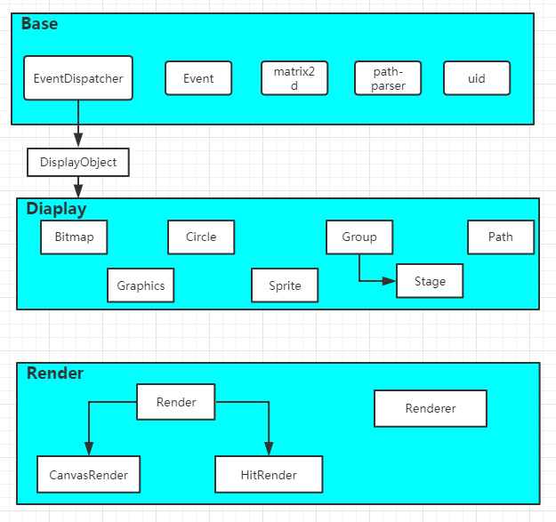

## 1. 类关系




## 2.1 通用方法

所有方法都继承于 `DisplayObject`

|方法|描述|
|---|---|
|isVisible()|判断是否视图可见|


## 2.2 Graphics 类

### 2.2.1 构造函数参数

### 2.2.2 类方法


|方法|描述|
|---|---|
|clear()|初始化Graphics操作|


**（1）绘制矩形**

|方法|描述|
|---|---|
|fillRect(x, y, width, height)|绘制一个填充的矩形|
|strokeRect(x, y, width, height)|绘制一个矩形的边框|
|clearRect(x, y, width, height)|清除指定矩形区域，让清除部分完全透明|


**（2）绘制路径**

|方法|描述|
|---|---|
|beginPath()|新建一条路径，生成之后，图形绘制命令被指向到路径上生成路径|
|closePath()|闭合路径之后图形绘制命令又重新指向到上下文中|
|stroke()|通过线条来绘制图形轮廓|
|fill()|通过填充路径的内容区域生成实心的图形|


**（3）移动笔触**

|方法|描述|
|---|---|
|moveTo(x, y)|将笔触移动到指定的坐标x以及y上|

**（4）线**

|方法|描述|
|---|---|
|lineTo(x, y)|绘制一条从当前位置到指定x以及y位置的直线|


**（5）圆弧**

|方法|描述|
|---|---|
|arc(x, y, radius, startAngle, endAngle, anticlockwise)|画一个以（x,y）为圆心的以radius为半径的圆弧（圆），从startAngle开始到endAngle结束，按照anticlockwise给定的方向（默认为顺时针）来生成|

**（6）三次贝塞尔曲线**

|方法|描述|
|---|---|
|bezierCurveTo(cp1x, cp1y, cp2x, cp2y, x, y)|绘制三次贝塞尔曲线，cp1x,cp1y为控制点一，cp2x,cp2y为控制点二，x,y为结束点|

参考链接：[MDN:使用canvas来绘制图形](https://developer.mozilla.org/zh-CN/docs/Web/API/Canvas_API/Tutorial/Drawing_shapes)


**（7）色彩 Colors**

|方法|描述|
|---|---|
|fillStyle(color)|设置图形的填充颜色|
|strokeStyle(color)|设置图形轮廓的颜色|


**（8）CanvasRenderingContext2D 和 CanvasGradient**

描述渐变的不透明对象
1. linearGradient
2. radiaGradient


|方法|描述|
|---|---|
|createRadialGradient(x0, y0, r0, x1, y1, r1)|是 Canvas 2D API 根据参数确定两个圆的坐标，绘制放射性渐变的方法。这个方法返回 CanvasGradient|
|createLinearGradient(x0, y0, x1, y1)|方法创建一个沿参数坐标指定的直线的渐变。该方法返回一个线性 CanvasGradient对象|
|addColorStop(offset, color)|方法添加一个由偏移值和颜色值指定的断点到渐变。如果偏移值不在0到1之间，将抛出INDEX_SIZE_ERR错误，如果颜色值不能被解析为有效的CSS颜色值 <color>，将抛出SYNTAX_ERR错误|
|lineWidth(value)|描述线段宽度的数字。 0、 负数、 Infinity 和 NaN 会被忽略|
|fillGradient()|根据canvas.currentGradient的值设置fillStyle|


参考链接：[MDN:reateLinearGradient()](https://developer.mozilla.org/zh-CN/docs/Web/API/CanvasRenderingContext2D/createLinearGradient)

参考链接：[MDN:createRadialGradient](https://developer.mozilla.org/zh-CN/docs/Web/API/CanvasRenderingContext2D/createRadialGradient)

参考链接：[MDN:addColorStop](https://developer.mozilla.org/zh-CN/docs/Web/API/CanvasGradient/addColorStop)

参考链接：[MDN:CanvasRenderingContext2D](https://developer.mozilla.org/zh-CN/docs/Web/API/CanvasRenderingContext2D)

### 2.2.3 Demo

```js
let curve = new Graphics();
let points = [100,100,200,20,300,200,337,154]
curve.clear().beginPath()
    .moveTo(points[0],points[1])
    .bezierCurveTo(points[2],points[3],points[4],points[5],points[6],points[7])
    .strokeStyle("#046ab4")
    .lineWidth(2)
    .stroke()
    .beginPath()
    .moveTo(points[0],points[1])
    .lineTo(points[2],points[3])
    .lineTo(points[4],points[5])
    .lineTo(points[6],points[7])
    .strokeStyle('red')
    .stroke()
```

## 2.3 Circle 类

### 2.3.1 构造函数参数

|属性|描述|
|---|---|
|r|radius，半径|

### 2.3.2 类方法


|方法|描述|
|---|---|
|draw(ctx)|绘制一个圆形，半径为r，原点为(0, 0)|

### 2.3.3 Demo
```js
let circle = new Circle(1); // r = 1
Circle.draw(ctx);
```

## 2.4 Bitmap 类


### 2.4.1 构造函数参数

|属性|描述|
|---|---|
|img|image对象|


## 2.5 Path 类

### 2.5.1 构造函数参数

|属性|描述|
|---|---|
|d|Path的路径|
|option|obj|

```
let defualtOption = {
    type        : 'path',
    fill        : 'black',
    stroke      : 'black',
    strokeWidth : 1
}
```

### 2.5.2 类方法

|方法|描述|
|---|---|
|draw(ctx)|根据Path指令绘制图像|

## 2.6 SVGObject

### 2.6.1 构造函数参数

|属性|描述|
|---|---|
|type|svg类型|

## 2.7 Sprite

### 2.7.1 构造函数参数

|属性|描述|
|---|---|
|option|对象|


|option对象属性|描述|
|---|---|
|属性|描述|
|x|起始绘制x坐标|
|y|起始绘制y坐标|
|animations|动画对象，含多个动画，每个属性（指一个单独动画）需要指定由哪些帧构成|
|currentAnimation|指定当前渲染动画对象的哪个动画|
|imgs|精灵图，以数组形式传入，如[img]|
|framerate|帧播放率，每一帧时间为1000ms/framerate|
|animationEnd|动画结束回调函数|
|tickAnimationEnd|每一帧结束回调函数|
|frames|每一帧在精灵图中的位置|

### 2.7.2 类方法

|方法|描述|
|---|---|
|play()|播放|
|pause()|暂停|
|reset()|重新从头开始动画|
|updateFrame()|更新为currentAnimation|
|gotoAndPlay(animation)|跳转到某个动画（必须在动画对象中有定义）|
|gotoAndStop(animation)|跳转并暂停在某个动画|


### 2.7.3 Demo

```javascript
var option = {
    "framerate": 7,
    "imgs": img_array,
    "frames": [
        // x, y, width, height, originX, originY ,imageIndex
        [0, 0, 32, 32],
        [32 * 1, 0, 32, 32],
        [32 * 2, 0, 32, 32],
        [32 * 3, 0, 32, 32],
        [32 * 4, 0, 32, 32],
        [32 * 5, 0, 32, 32],
        [32 * 6, 0, 32, 32],
        [32 * 7, 0, 32, 32],
        [32 * 8, 0, 32, 32],
        [32 * 9, 0, 32, 32],
        [32 * 10, 0, 32, 32],
        [32 * 11, 0, 32, 32],
        [32 * 12, 0, 32, 32],
        [32 * 13, 0, 32, 32],
        [32 * 14, 0, 32, 32]
    ],
    "animations": {
        "walk": {
            "frames": [0, 1]
        },
        "happy": {
            "frames": [11, 12, 13, 14]
        },
        "win": {
            "frames": [7, 8, 9, 10]
        }
    },
    "currentAnimation": "walk",
    tickAnimationEnd: function () {
    },
    animationEnd: function () {
    }
};

var sprite = new Sprite(option);
```


## 2.8 Group

### 2.8.1 构造函数参数
### 2.8.2 类方法
|方法|描述|
|---|---|
|add(...child)|为当前节点添加子节点|
|remove(...child)|删除当前节点中的选中子节点|


## 2.9 Stage

继承Group

### 2.9.1 构造函数参数
### 2.9.2 类方法

构造函数参数

|属性|描述|
|---|---|
|width|canvas宽度|
|height|canvas高度|
|renderTo|渲染的挂载节点，如body|
