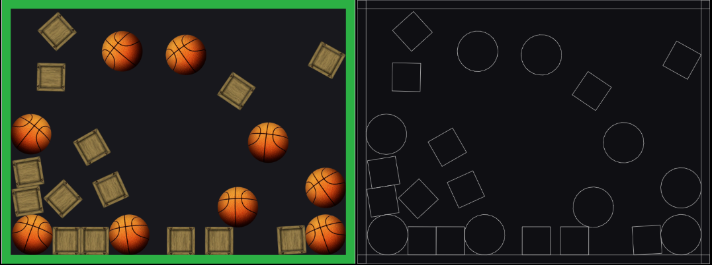

# Cax + Matter-js 物理引擎结合使用

最初试过 box2dweb 与 [cax框架](https://github.com/dntzhang/cax) 结合使用，发现 box2dweb 的代码会导致 webpack 编译出的 cax 包模块执行顺序乱套。
box2dweb 貌似也没有官方文档和维护地址，所以弃坑转战 Matter-js。

Matter-js 是 Github 上最流行的 Web 2D 物理引擎，主要有如下特性：

* 支持刚体、混合体、复合体
* 支持凹凸多边形刚体
* 支持刚体间约束条件
* 内置睡眠与静止身体
* 物理模拟时间加快变慢
* 移动兼容（触摸事件和PC鼠标事件响应）
* 物理性质（质量、面积、密度、动量守恒、摩擦阻力、重力、弹性或非碰撞检测以及恢复等）

## 开始结合 Cax 和 Matter-js

### 引入 js

先在 HTML 引入 matter-js 和 cax, 你可以通过 npm 或 cdn 获取 js:

* [https://unpkg.com/matter-js](https://unpkg.com/matter-js)
* [https://unpkg.com/cax](https://unpkg.com/cax)

### 准备工作

页面添加 Canvas

``` html
<canvas id="myCanvas" width="800" height="600"></canvas>
```

提前声明好变量:

``` js
var Engine = Matter.Engine,
            Render = Matter.Render,
            World = Matter.World,
            Bodies = Matter.Bodies,
            Composites = Matter.Composites,
            Body = Matter.Body,
            Constraint = Matter.Constraint,
            MouseConstraint = Matter.MouseConstraint,
            Common = Matter.Common,
            Events = Matter.Events,
            Composite = Matter.Composite
```

### 创建刚体

```js
Bodies.rectangle(100, 49, 800, 44, { isStatic: true })
```

* 前四个参数分别代表 x y width height。需要注意的是 x 和 y 是矩形中心的坐标
* `isStatic` 为 true 的话代表是静止刚体，不传或者传 false 为可运动刚体。

### 创建四面墙并添加到世界

```js
// 创建引擎
var engine = Engine.create();

// 创建四面墙壁墙壁并添加到世界
var offset = 10;
World.add(engine.world, [
    Bodies.rectangle(400, 600 - offset, 800, offset * 2, { isStatic: true }),
    Bodies.rectangle(400, offset, 800, offset * 2, { isStatic: true }),
    Bodies.rectangle(offset, 300, offset * 2, 600, { isStatic: true }),
    Bodies.rectangle(800 - offset, 300, offset * 2, 600, { isStatic: true }),
]);
```

### 创建物体并添加到世界

``` js
var stack = Composites.stack(20, 20, 6, 4, 0, 0, function (x, y) {
    if (Common.random() > 0.5) {
        return Bodies.rectangle(x, y, 64, 64, {
            bitmap: new cax.Bitmap("img/box.jpg")
        });
    } else {
        return Bodies.circle(x, y, 46, {
            desity: 0.0005,
            frictionAir: 0.06,
            friction: 0.01,
            bitmap: new cax.Bitmap("img/basketball.png"),

        });
    }
});

World.add(engine.world, stack);
```

通过`Composites.stack(xx, yy, columns, rows, columnGap, rowGap, callback)`可以用来创建物体堆。
  参数xx,yy分别为物体堆中第一个物体的x和y坐标，columns和 rows分别为所要创建的物体堆的列数和行数，columnGap和rowGap分别为物体与物体之间的列间隙和行间隙，最后，由var body = callback(x, y, column, row, lastBody, i); 可以看出callback为生成的具体物体的方法。 

看以看到，创建的时候挂在 bitmap 上去用户后续的渲染。

### 发动引擎

```js
Engine.run(engine)
```
### 初始化渲染墙壁和物体

```js
var bodies = Composite.allBodies(engine.world);

for (var i = 0; i < bodies.length; i += 1) {
    var obj = bodies[i]
    if (obj.bitmap) {
        obj.bitmap.x = obj.position.x
        obj.bitmap.y = obj.position.y
        if (obj.label === 'Circle Body') {
            obj.bitmap.scaleX = obj.bitmap.scaleY = 92 / 128
            obj.bitmap.originX = 64
            obj.bitmap.originY = 64
            obj.bitmap.rotation = obj.angle * 180 / Math.PI
        } else {
            obj.bitmap.scaleX = obj.bitmap.scaleY = 64 / 200
            obj.bitmap.originX = 100
            obj.bitmap.originY = 100
            obj.bitmap.rotation = obj.angle * 180 / Math.PI
        }
        stage.add(obj.bitmap)
    }
}

//墙壁
var topRect = new cax.Rect(800, 20, { fillStyle: '#2CB044' })
stage.add(topRect)
var bottomRect = new cax.Rect(800, 20, { fillStyle: '#2CB044' })
bottomRect.y = 600 - 20
stage.add(bottomRect)
var leftTop = new cax.Rect(20, 600, { fillStyle: '#2CB044' })
stage.add(leftTop)
var rightRect = new cax.Rect(20, 600, { fillStyle: '#2CB044' })
rightRect.x = 800 - 20
stage.add(rightRect)
```

* 通过 `Composite.allBodies` 可以拿到所以刚体
* 通过设置 bitmap 的 scaleX 和 scaleY 可以使 刚体大小和纹理大小对应起来

### 更新渲染舞台

```js
cax.setInterval(function () {
    var bodies = Composite.allBodies(engine.world);
    for (var i = 0; i < bodies.length; i += 1) {
        var obj = bodies[i]
        if (obj.bitmap) {
            obj.bitmap.x = obj.position.x
            obj.bitmap.y = obj.position.y
            obj.bitmap.rotation = obj.angle * 180 / Math.PI
        }
    }

    stage.update()
}, 16)
```

### 添加 Matter-js 内置 Debug Canvas

```js
var render = Render.create({
    element: document.body,
    engine: engine,
    options: {
        wireframes: false
    }
});
var renderOptions = render.options;

renderOptions.wireframes = true;
Render.run(render);
```

最终效果:



[【→ 在线演示】](https://dntzhang.github.io/cax/packages/cax/examples/matter/)
